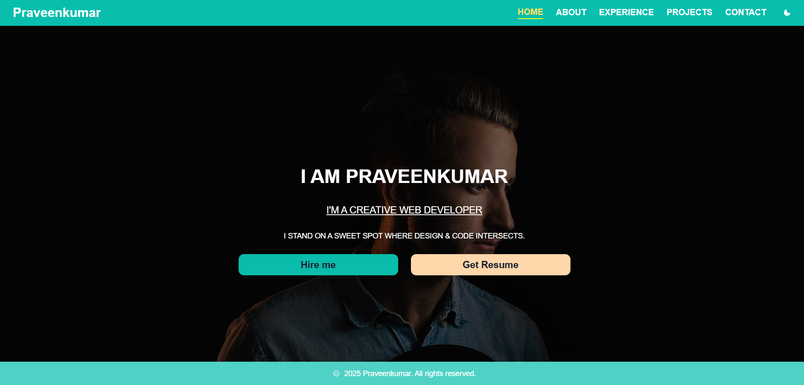

# 🚀 Praveenkumar S — Developer Portfolio

A modern and responsive developer portfolio built using **React** and **Chakra UI**, showcasing my skills, projects, education, and certifications. The site follows SPA design principles with smooth navigation using scrollspy and hash linking.

## 📸 Preview

## 🌐 Live Demo

---

## ⚙️ Tech Stack

-   ⚛️ **React** – Component-based frontend library
-   🎨 **Chakra UI** – Accessible and modular UI components
-   🔗 **React Router & HashLink** – SPA-style navigation
-   📦 **Vite** – Blazing-fast build tool for React
-   ☁️ **Netlify** – Deployment platform for static sites

---

## 📁 Features

-   Smooth scroll-based navigation using `react-use-scrollspy` and `react-router-hash-link`
-   Light/Dark theme toggle
-   Responsive design for all screen sizes
-   Projects with live demo and GitHub links
-   Education and experience sections
-   HackerRank certification showcase

---

## 📜 Sections Included

-   🏠 Home
-   👨‍💻 About Me
-   💼 Experience & Education
-   🛠️ Skills & Tech Stack
-   💡 Projects
-   📜 Certifications
-   📞 Contact

---
